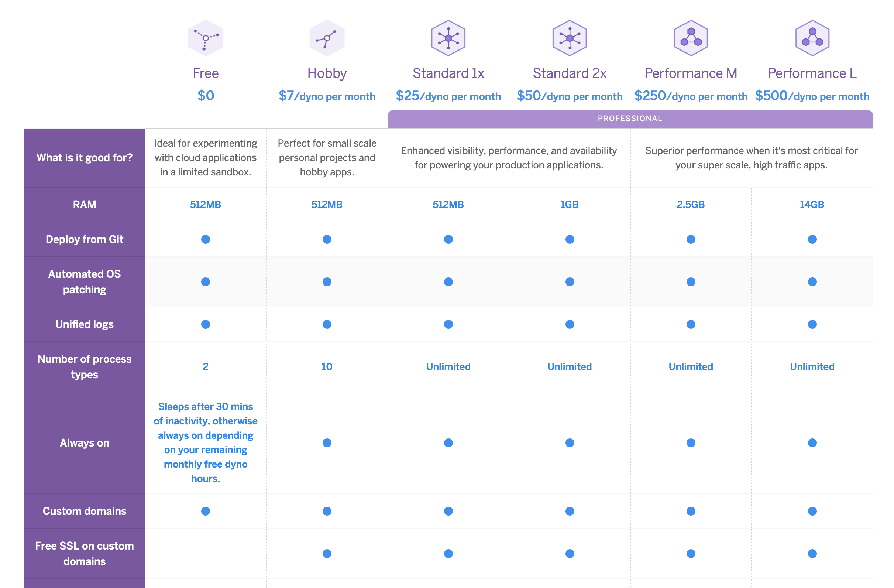
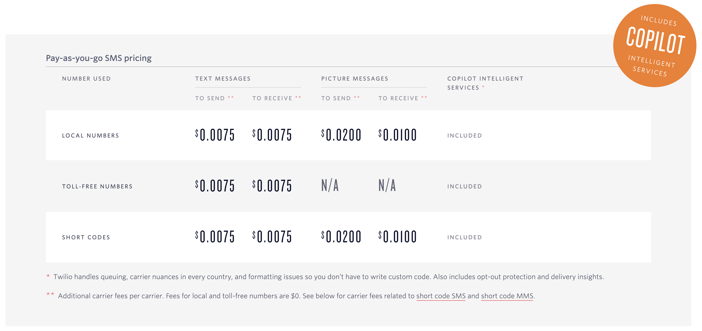

# Tech Stack
---
## Front End
---
### Netlify

[Pricing](https://www.netlify.com/pricing/#features)

We could probably get away with the free tier.  Maybe Pro version?

---
---
## Back End
---
### Heroku

[Pricing](https://www.heroku.com/pricing)

Assuming that we'll be hosting our servers on here.  We might need multiple dynos?

Maybe $100 a month
$1200 a year?

---
### MongoDB

[Pricing](https://www.mongodb.com/cloud/atlas/pricing)

How much storage do we need for our users?

Assuming we use an M10 Cluster with 40 GBs
- $0.10/hr

If this is running nonstop:
- $876 dollars for a year

Assuming our current space per users:
- 14 users is 2.7KB
- 

---
---
## Services
---
### Twilio

We are going to use the programmable SMS

[Pricing](https://www.twilio.com/sms/pricing/us)

$0.0075 per incoming/outgoing message

How many messages are we sending a month?
Per couple:
- 2 messages for each person
- Once a day per weekday
- 40 messages a month in total
- $0.30 a month

1,000 Couples:
- $300 a month
- $3,600 a year
- If you count replies
- $7,200 a year

:)